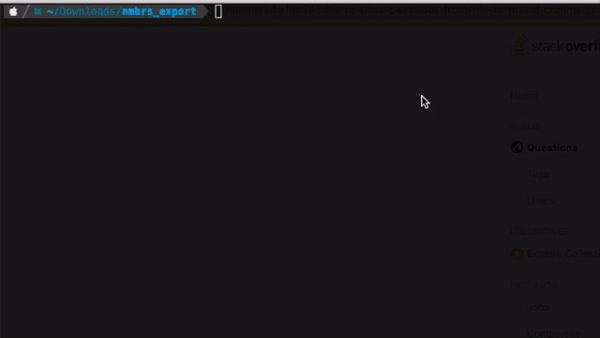

# Nmbrs to Hibob 

## Salary slip PDF export
At the time of writing there is no integration between [Nmbrs and Hibob](https://appstore.nmbrs.com/s/hibob) in the app 
store.
This command line application allows you to export the salary slip PDFs for a run to a zip file that can be [imported
in bulk](https://help.hibob.com/hc/en-us/articles/4409775877265-Importing-documents-in-bulk-into-Docs-in-bob) to Hibob.
Nmbrs' `EmployeeNumber` is use as the key to link to Hibob's `Employee ID`



```
usage: nmbrs_hibob [-h] [--user USER] --token TOKEN [--run RUN] --year YEAR [--company COMPANY] [--description DESCRIPTION] [--email]

Export salary slip PDFs from Visma Nmbrs into Hibob

optional arguments:
  -h, --help            show this help message and exit
  --user USER, -u USER  API user
  --token TOKEN, -t TOKEN
                        The API token https://support.nmbrs.com/hc/en-us/articles/360013384371-Nmbrs-API
  --run RUN, -r RUN     The run to download. Prints all runs for the year if not set.
  --year YEAR, -y YEAR  The year in which the run took place
  --company COMPANY, -c COMPANY
                        Select specific company number
  --description DESCRIPTION, -d DESCRIPTION
                        Will be appended to the PDFs instead of the run description
  --email, -e           Indicates whether to use company email as folder name. Otherwise employee Id will be used

```

The resulting zip file will contain folders with the customer's email addresses. Within these folders the salary slips
are named `<year>_<run>_Salary.pdf`.